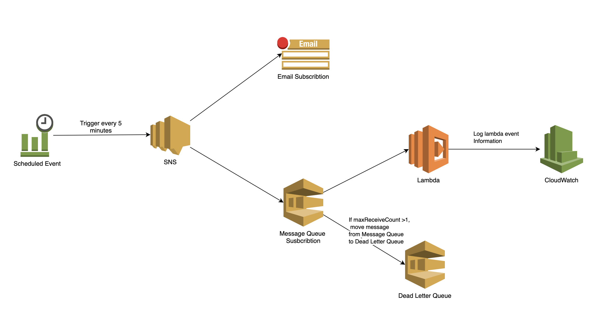

# Basic
### SNS 是什么服务？解决什么问题？
Amazon Simple Notification Service (SNS) 是一种高度可用、持久、安全、完全托管的发布/订阅消息收发服务. Amazon SNS 提供了面向高吞吐量、多对多推送式消息收发的主题。借助 Amazon SNS 主题，发布系统可以向大量订阅终端节点（包括 Amazon SQS 队列、AWS Lambda 函数和 HTTP/S Webhook 等）扇出消息，从而实现并行处理。此外，SNS 可用于使用移动推送、短信和电子邮件向最终用户扇出通知。

解决的问题:
  可以轻松分离微服务、分布式系统和无服务器应用程序.

参考文章: https://aws.amazon.com/cn/sns/

### SQS 是什么服务？解决什么问题？
Amazon Simple Queue Service (SQS) 是一种完全托管的消息队列服务，借助 SQS，可以在软件组件之间发送、存储和接收任何规模的消息，而不会丢失消息，并且无需其他服务即可保持可用.

解决的问题:
  可以轻松分离和扩展微服务、分布式系统和无服务器应用程序. SQS 消除了与管理和运营消息型中间件相关的复杂性和开销，并使开发人员能够专注于重要工作。

参考文章: 
  https://aws.amazon.com/cn/sqs/

# Practice

### Architecture Diagram


### Deploy Scripts
1. Deploy bucket for further deployment
```
./auto/deploy-deployment-bucket
```

2. Deploy resources for week6 homework
```
./auto/deploy
```

### 实现功能点
- CloudWatch Event Role 每 5 mins 自动触发SNS的Topic

- SNS 
  - SNS自动发送邮件，邮件内容包含所有 event 的内容
  - SNS向订阅的SQS中发送消息
  - SNS Encryption
  - SNS Tags
  - SNS Permission
  - DeliveryPolicy 用于定义HTTP/S endpoint的尝试机制, 因此在此例子未实现

- SQS
  - 有retention(7days) / timeout(5mins)
  - SQS自动触发Lambda运行，Lambda将event的所有内容输出到CloudWatch log中
  - SQS Subscription有DLQ
  - SQS Encryption

- Tagging
- As Code: CFN
- 使用Docker部署
